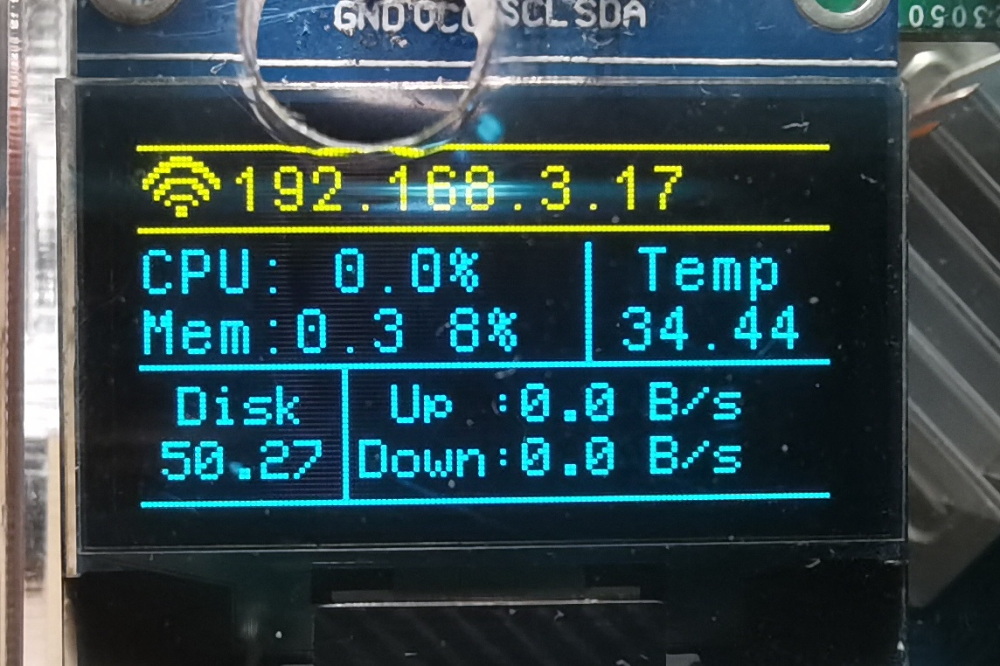

# OrangePi4LTS 实时设备信息显示

### 简介

把stm32上的SSD1306驱动移植到了OPi4上，然后百度还有学习着写了一些获取设备信息的代码

能显示的信息包括：

**网络是否链接**（图标）

**IP地址**

**CPU使用率**（CPU）

**已用内存和使用率**（Mem）

**CPU温度**（Temp）

**磁盘剩余容量**（Disk）

**上下行网速**（Up/Down）

